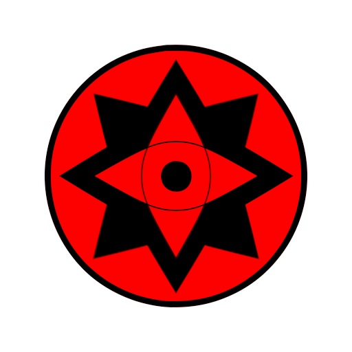

# 宇智波青莲

## 典籍
> ### 西晋 《维摩诘(jié)所说经.卷上》
> “目净修广如青莲，心净已度诸禅定。”
>
> 睡莲小巧，花瓣千叶，且朝开暮合，花瓣细长，恰恰像慈悲安静的人，低垂的眼睛
>
> “青色之莲华也。其叶修广，青白分明，有大人眼目之相，故取以譬佛之眼。” 

> ### 南梁 · 萧纲 《释迦文佛像铭》
> “至矣调御，行备智周。满月为面，青莲在眸。心珠可莹，智流方普。” 

> ### 竹取物语
> 辉夜姬道：“请稍待！穿上这羽衣，便会立时脱胎换骨，心意亦会改变。但我此刻尚有话要说。”
> 
> 她将装有不死灵药的壶，和书信放在一起，唤来头中将，让他带进宫交给天皇。天人将书信、药壶转呈中将后，立即将**天之羽衣**披到辉夜姬身上。辉夜姬顿时忘记了对伐竹翁的恋恋不舍、忘记了离别的悲伤，在人间的种种往事，由于穿上羽衣的缘故，全都忘得一干二净。烦恼散尽的辉夜姬，登上云车，在一百多名天人的前呼后拥下，升天而去，归返月宫。

> ### 古事记
> 由于素盏鸣尊在高天原大闹时天照大御神吓得躲进了天之岩户，天岩户和天儿屋命取下天香山公鹿的全副肩胛骨和天之朱樱树皮焚烧，占卜神意，天岩户持大御币，天儿屋命诵祝祷之词。天钿女命在天岩户前起舞，待天手力男神把天照从岩户中拉出来的一刻，天岩户将一根挂着稻穗的注连绳横挂在天之岩户前，形成**空间结界**。这样，天照大神就再也无法躲回天之岩户。

## 外貌设定
在灭族之夜的压力下从十岁开始进行近乎自残的疯狂修炼，结果导致身体发育和身体潜力受影响，二十岁时才长到一米五，外表看上去只有十三岁，此时开启了轮回眼，拥有了能力神魂命，从此长生不老。

## 性格
性格内向，直接，不善言辞，喜欢修炼探索更高的境界。

## 战斗模式
青莲的战斗模式倾向于近战刀术，顶尖的速度和刀术再加上写轮眼幻术使她近战少有敌手，大部分情况下都是直接秒杀敌人，另有少量的忍术满足基本的远距离和范围攻击。

开启万花筒后，天岩户让她在防御上几乎无敌，除了攻击性时空忍术神威和夜凯，其他攻击都破不了她的防御。同时在须佐能乎的加持下她的刀术攻击范围也大大加强变成了远程和范围攻击。

开启轮回眼之后虽然拥有了更多的能力，但她仍然习惯于自己的刀术体系，轮回眼对她来说只是增加了她查克拉的质量以及通过万象天引来拉近与敌人的距离。

自创刀术：
* 破军：将大部分查克拉聚集到刀尖形成锥形气刃，剩下的查克拉强化身体以飞速突击一点破面，用于突破敌人大范围攻击。
* 战岚：沉下身子，全身猛力旋转，轴心脚交换移动同时，挥刀横扫，属移动攻击技，同时攻击水平面四个方向。
* 燕返：  
    以肋构/八相/上构的方式起手  
    1.唐竹（竖劈）→逆袈裟→左/右刈（雉）  
    2.逆风（上挑）→袈裟斩→逆袈裟  
    3.雉→袈裟→逆风  
    步法，左脚在前，配合第一斩击右脚踏前一步，左肘发力转线的时候，左腿发力带动左肩将刀快速甩出去，  最要命的地方来了，最后一刀，注意上述两步动作你已经变成了一个弓步姿势，现在要求你左腿跟上的同时，右脚虚点半步，只能通过上半身发力打出第三条刀线。。。。这就是最最最大的难点。腕力 臂力 腰部力量的考验和时间点的把控。然后，弹返。。。没错 燕返し是没有防御时间和技巧支持的只能借助碰到对手给你的反作用力来完成你的调整。【剣術，始于弹返，终于弹返。就算是双刀，野刀，居合，一心 也不例外】
* 圆舞：身体下沉，双腿稳扎地面，以腰为轴，以圆为弧，迅猛地在周身舞剑花，形成球形防御领域。
* 一闪：在与敌人拼刀后借助反弹的力量再次挥刀，发出成倍的斩击速度，需要有合适的时机以及强大的对时机的把握能力。
须佐刀术：
* 风锤：用须佐村正背发起势大力沉的攻击，同时在刀背凝聚大量厚重的查克拉，发出大范围的钝击，用以弥补青莲范围攻击的不足。
* 断空：以须佐村正融合天岩户的能力发出斩击，能够切断空间。
* 跃空：以须佐村正融合天岩户的能力发出跨越距离的空间斩击，是断空的一种远距离进阶形态，刚开始只能在五米内形成空间斩击，随着熟练度的提高距离渐渐提高到了几十米。
* 碎空：以须佐村正融合天岩户的能力发出数十道大范围的空间斩击，是跃空与圆舞的一种结合形态，几十米内的空间都将被斩断成碎片，并随之爆发恐怖的空间乱流将敌人彻底撕碎，对自身的消耗也是极大！

辅助能力：
* 空间隧道：以**天岩户**的能力为基础结合**飞雷神之术**的原理开发而出了的能力，能够在任意空间的两点建立时空隧道进行时空穿梭，瞳力消耗跟距离有关，一光年内的消耗几乎可以忽略不记。
* 天岩户飞雷神：结合**天岩户**和**飞雷神之术**，无需特质苦无直接用**天岩户**标记空间节点并进行瞬间移动，比飞雷神更加灵活。
* 空间牢域：将**天岩户**形成的结界展开包围一个空间，并对内部空间通道的建立进行干扰，禁止敌人进行空间移动。

## 木叶45年
与弟弟宇智波桃源一同诞生。

## 木叶50年，第三次忍界大战结束
五岁时因父亲宇智波桃矢死亡开启双勾玉写轮眼。

## 木叶55年
十岁时通过自己的艰苦修炼开启三勾玉。

## 木叶58年四月，灭族之夜前夕
年龄：十三  
血脉：宇智波  
血脉能力：三勾玉，火属性，水属性  
习得能力：掌仙术，幻术·写轮眼，魔幻·镜天地转，火遁·豪火球之术，火遁·豪龙火之术，水遁·水断波，水遁·水牢之术  
忍术：【奥】掌仙术、火遁·豪龙火之术  
体术：【奥】瞬身术、战斗预知（只看对手的双腿进行战斗）  
八维：体10，速10，力7，精6.5，忍10，幻5，印6，贤9（总分63.5，上忍）

## 灭族之夜
在母亲遇险之时开启万花筒。
* 万花筒右眼：天之羽衣，激发辉夜血脉，吸收血脉碎片融合大筒木辉夜血脉。
* 万花筒左眼：天岩户，空间结界，防御力强大。  
* 须佐能乎：紫红色，武器——妖刀村正，斩击强化，刀气强化。

随后将左眼与弟弟右眼交换，配合天之羽衣激活血脉开启缓慢地融合过程。

## 木叶59年上半年
十四岁时完成左眼移植弟弟的万花筒，左眼进化为永恒万花筒。  

## 木叶59年下半年
先后找到漩涡香燐和辉夜君麻吕，使用天之羽衣融合血脉。 

## 木叶60年上半年
十五岁时完成右眼一直弟弟的万花筒，右眼进化为永恒万花筒。

## 中忍考试前夕(木叶63年下半年)
年龄：十八岁  
血脉：宇智波、漩涡、千手、辉夜  
血脉能力：
* 永恒眼右眼：归途，须佐能乎(完全体)  
* 尸骨脉
* 自愈、神乐心眼

习得能力：
* 尾兽玉

## 中忍考试中(木叶63年下半年)
血脉：大筒木(宇智波、漩涡、千手、辉夜、日向)  

## 木叶66年上半年，鸣人回村
二十岁时融合阴阳两种属性的查克拉成功开启轮回眼，两只眼睛能力相同，名为神魂命。
* 单轮回眼：断肢重生，不老
* 双轮回眼：持续而缓慢地增加身体潜力。