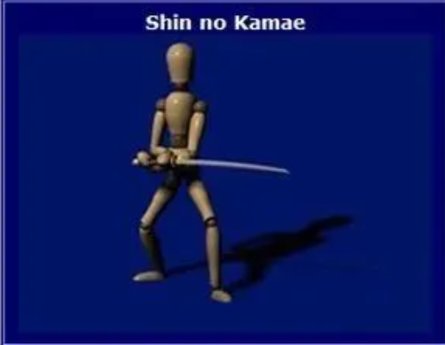

# 剑术

## 剑术构型

1.上段の构 Jodan no kamai

左脚向前一步举刀过头，左手抵额头。

2.清眼の构 Seigan no kamae

又称中段，右半身位。剑尖指敌方喉咙或眼睛，手肘适中位置，左手距离身体三四寸。 这个姿势可攻可守毫无破绽。

3.下段の构 (migi/hidari) gedan no kamae

包括下段、左下段、右下段。右下段指右脚在前，腿充分拉开，腰下放，剑尖指对方膝下，但要注意目光不能只盯下方。左下段时，左脚在前，左手轻靠刀柄，不握。这个不是进攻姿势，是应变姿势。

4.阴の构 In no kamae

可自然体或左脚在前，太刀在右肩上，右拳在肩上眼部高度，左拳在距离右胸三四寸，刀身可略向后外方，刀刃向前，肩肘手不要太紧张。这个姿势即是等待的姿势，也利于进攻防守。

5.斜の构 Sha no kamae

又叫车之构。通常是自然体或右脚在后，腰往下沉，太刀向后，手往下放，刀刃对下前方，刀藏于后方。这个姿势是收回太刀，监视敌人举动。

6.鸟居の构 Torii

右半身蹲下，右手握刀，右肘弯曲，右手放右前额上方（贴头），左肘伸出，左手放近刀尖处，这是用来顶住对方面讨的姿势，并可发起进攻。

7.心の构 Shin no kamae

左半身向前大步跨开，腰部充分下垂，左肘弯曲，左手轻扶太刀，双手在水月处交叉，刀尖对敌人胸口正中，刀刃朝上。这个姿势用于避免被敌人攻击右上半身，可结合后退使用。

8.小霞 Ko gasumi

右脚向右打开剑尖朝左，刀刃朝上，左右手在脸前交叉成十字。敌人面讨时接刀防守。这个姿势不光是防守动作，根据身体打开的姿势和手的位置也可以变成进攻的姿势。 如果是左脚向前踏出则称为千鸟之小霞。

9.大霞 O gasumi

左脚往前，呈深弓步张开，右手伸直，太刀和右手呈直线，左手正常握剑，剑尖对准敌人左眼，刀刃向上。做这个动作时身体容易向前倾，注意不要失去重心。 这是逆袈裟斩完后稳定身体的姿势。

10.手里霞 Te ura gasumi

右侧身站位，太刀端平，剑柄位于额头高度，剑尖指向敌方眼睛，双肘放松，这是个善于防守上段攻击并可以做出反击的姿势。

## 九个击剑基本方位

唐竹（当头直劈）、袈裟斩（右斜切）、逆袈裟（左斜切）、左横切、右横切、左切上、右切上、逆风（从下而上）、还有突刺