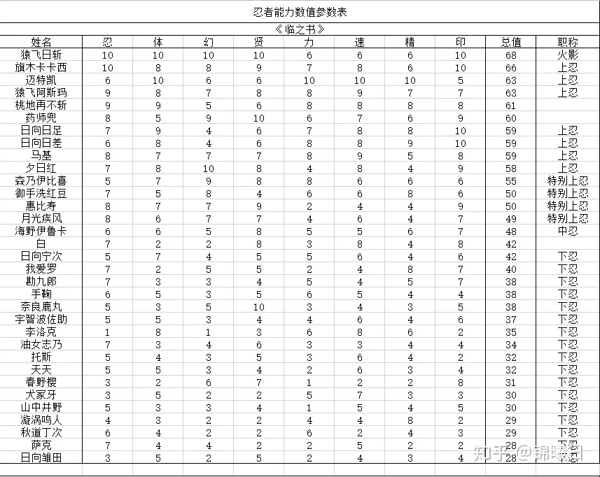
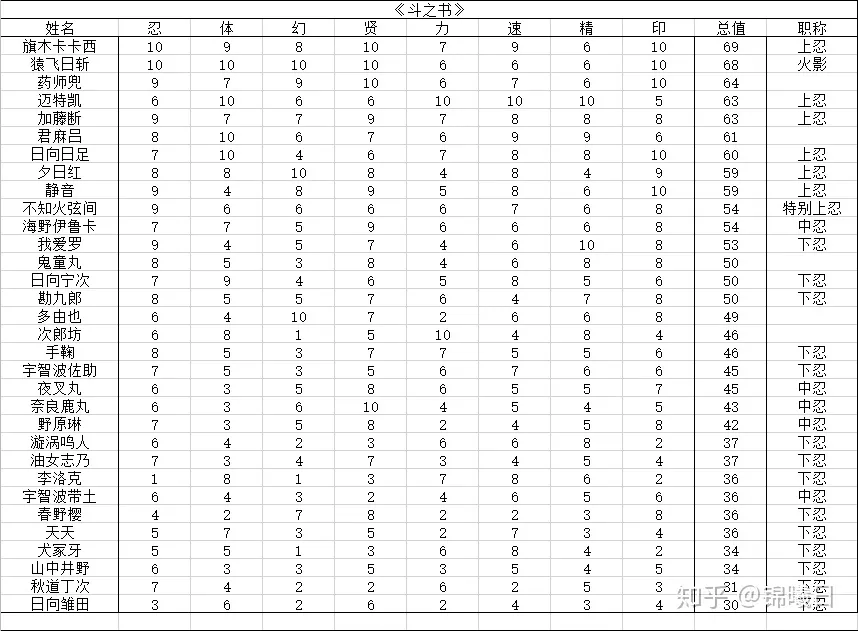
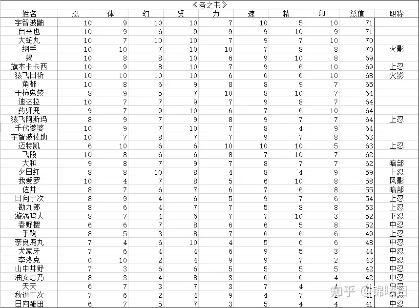

上忍和特别上忍交界在58～55

特别上忍和中忍交界在49～48

中忍和下忍交界在48～42

t1:大筒木辉夜

第一必须得给到非常低能但却顶级高配的辉夜大妈，虽然技能模式比较笨b，但技能命中后的强度非常变态，并且共杀灰骨➕黄泉比良坂的组合可以很好的起到初见杀的效果（但辉夜对战第七班的时候又蠢又贪查克拉导致多次不下死手还被大幅消耗）当然，辉夜本身不论怎么说也是单挑能力无敌的存在（六道地爆天星必须要双人才能释放、尾兽共鸣的路子也因为强悍的大兔子而被封死了）

t2：大筒木羽衣

为了解释一下他的牛逼，需要先拿鸣人打个比方，首先轮回眼是可以感知查克拉量的,而在斑的感知下，鸣人的六道仙人模式在查克拉的量上其实相比先前的模式并没有什么明显变化,直到实战打到之后才判断出是对方“质”提升了。

并且六道鸣人自身最大的查克拉量依仗，也依旧是他体内的九尾，而不是六道仙人模式，不论是终结谷让九尾高达吸收自然能量转换成仙术查克拉、亦或是冰雪世界发动几千个影分身，查克拉量的主要来源都是九尾。

而六道仙人是什么情况呢？他有能力直接赐予鸣人如此强悍的“质”的六道仙人模式，而十尾老头则可以把十尾这个量级的查克拉进一步提升成仙术查克拉，简而言之，他的查克拉不仅是“质”强悍无比，在“量”上也直接完爆了六道鸣人几十条街，如此“质”配上如此量，六道鸣和六道斑只配被十尾人柱力羽衣揍成猪头。

更别说公式书的标志还显示这老头子还掌握了血继网罗，青年时期虽说激斗十尾，但他能开发出六道地爆天星这种强力封印术，老年在灵魂形态下还能瞬间解除秽土转生。

只能说明老头子本人对术的理解和造诣那都是极其变态的，所以虽说他不喜争斗，但也并不代表他不擅争斗，给他逼急了指不定就原地造个术开虐，放在第二绝对当之无愧。

t3：三眼斑

排除辉夜和老头以外的无敌手，唯一有几率靠繁琐的尾兽共鸣击败他的鸣人也只会被更加快速且更加霸道的无限月读的机制杀送走。

t4: 六道鸣人、双眼斑

这俩属于激斗，鸣人查克拉的质强于斑，斑虽然质不行，但是靠轮墓能拖住鸣人且斑查克拉的量大于鸣人，所以双方各有优势。

t5: 单眼斑、六道带土（被六道鸣人属性压制并完成单刷的水平）。

t6: 轮回眼佐助、羽村

轮回佐自身难以处理十尾人柱力的阴阳遁求道玉、难以动摇十尾人柱力根基（拔出尾兽），攻击技能组基本还停留在永恒万花筒阶段，实战只能靠天手力的突袭来占便宜，然而他排名之上的对手人均恢复力、续航水平完爆他二十条街。

即使是六道带土，人家在暴走期间不小心炸掉自己半个身体，他眨眼间也在水门发动下一次进攻前完成了复原。

带土一次性的“吐树”技能也是个小神技，发动后立马暴涨神树，让其一瞬间就吞噬干净了在他附近的阴阳九尾两座高达的查克拉。

水门还能有机会用飞雷神跑路、而仙狐鸣人则是差点被秒了，直接被榨干成常态（幸好被秽土三代救下来了）。

简而言之，佐助这货单挑带土的时候想别被这招秒了都难，并且带土还能在吐树的基础上继续召唤各种形式的攻击型木遁。

没有周围几万联军牵制大量木遁，当初鸣佐也是根本没机会拿下六道带土的，更别说攻击力孱弱的轮回佐单人了，他就一破完成体须佐配10米天手力，面对这招一点用都没有。

而且倘若没有先前的父子联手强行逼出这个只能释放一次的杀招，你让同期的威装鸣佐上场也只有被带土原地“吐树”秒杀的份，所以别小看十尾人柱力，六道鸣能飞、速度快、大型熔遁手里剑能切神树、沸遁怪力无双能爆气、求道玉能罩自己，所以他能对付这招，但这并不代表轮回眼佐助也能做到以上任何一点，以他的水平只有挨打的份。